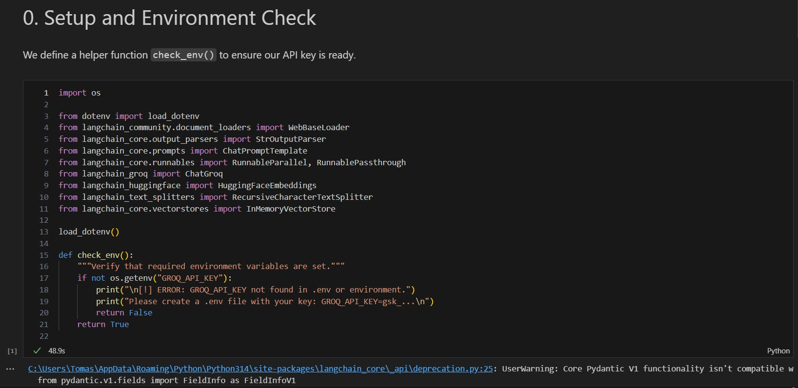
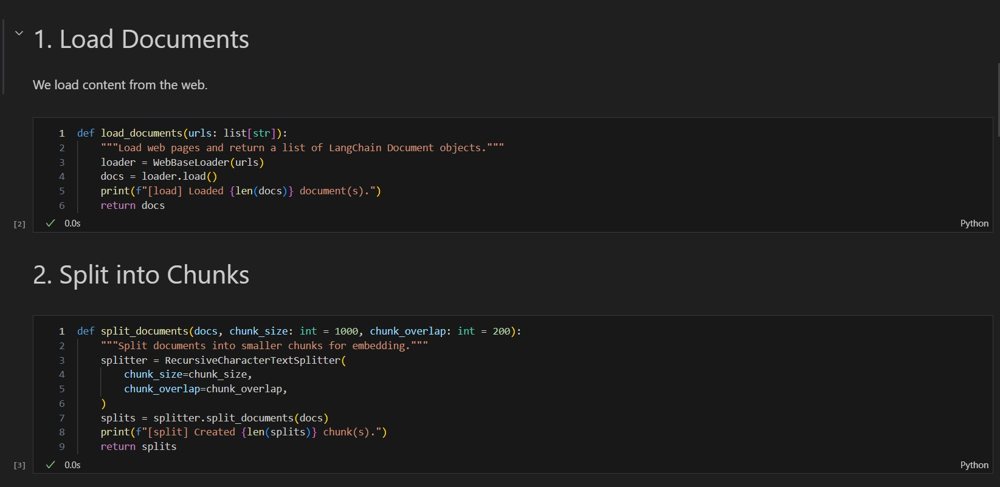
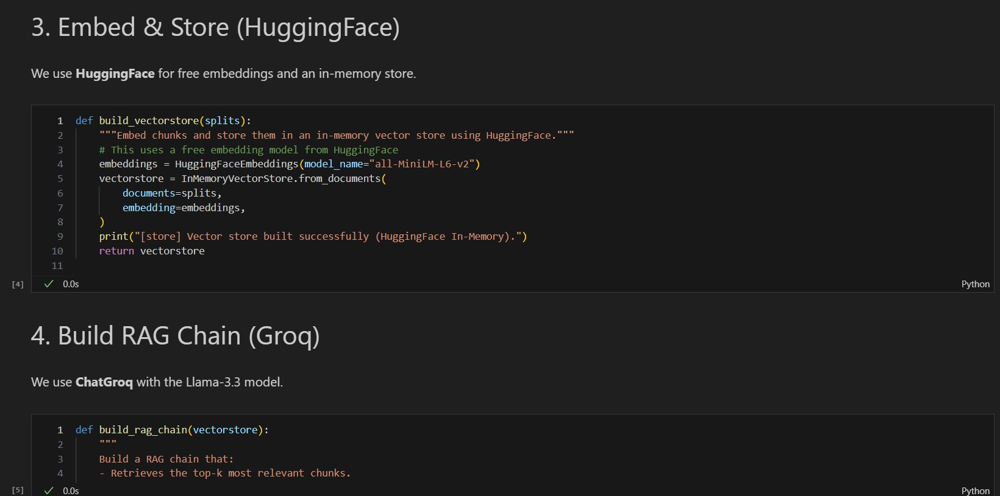
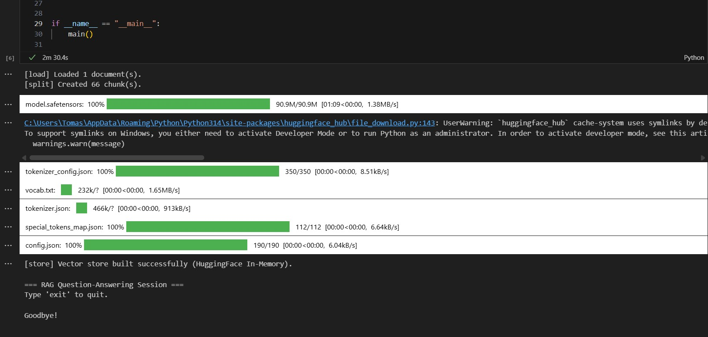

# repositorioRAGs2 – RAG Project with LangChain & Groq

A **Retrieval-Augmented Generation (RAG)** application built with [LangChain](https://python.langchain.com/), [Groq](https://groq.com/), and [HuggingFace](https://huggingface.co/).

The system loads web documents, splits and embeds them using **local HuggingFace models**, then answers natural-language questions using **Groq** for high-speed LLM generation.

---

## Architecture

The system uses an **In-Memory Vector Store** and **Local Embeddings** to ensure zero infrastructure overhead and maximum reliability.

```
┌─────────────────────────────────────────────────────────────────┐
│                        RAG Pipeline                              │
│                                                                  │
│  ┌──────────┐   ┌──────────┐   ┌──────────────┐                │
│  │  Load    │──▶│  Split   │──▶│  Embed &     │                │
│  │ (Web)    │   │ (Chunks) │   │  Store       │                │
│  └──────────┘   └──────────┘   │ (In-Memory)  │                │
│                                └──────┬───────┘                │
│                                       │ retriever               │
│                       ┌───────────────▼────────────────┐       │
│  User Question ───────▶  Retrieve top-k relevant chunks │       │
│                       └───────────────┬────────────────┘       │
│                                       │                         │
│                       ┌───────────────▼────────────────┐       │
│                       │  Format prompt (system + user)  │       │
│                       └───────────────┬────────────────┘       │
│                                       │                         │
│                       ┌───────────────▼────────────────┐       │
│                       │     Groq (Llama 3.3 70B)       │       │
│                       └───────────────┬────────────────┘       │
│                                       │                         │
│                              Answer ◀─┘                         │
│ └─────────────────────────────────────────────────────────────────┘
```

### Key Components

| Component | Library | Role |
|-----------|---------|------|
| Document Loader | `langchain-community` – `WebBaseLoader` | Fetches and parses web pages |
| Text Splitter | `langchain-text-splitters` – `RecursiveCharacterTextSplitter` | Splits docs into overlapping chunks |
| Embeddings | `langchain-huggingface` – `HuggingFaceEmbeddings` | Generates vectors locally (free) |
| Vector Store | `langchain-core` – `InMemoryVectorStore` | Stores and searches embeddings in RAM |
| LLM | `langchain-groq` – `ChatGroq` | Generates answers with ultra-low latency |
| Chain | `langchain-core` – `LCEL` | Wires retrieval and generation together |

---

## Prerequisites

- Python 3.11 or higher
- A [Groq API key](https://console.groq.com/keys)

---

## Installation

```bash
# 1. Clone the repository
git clone https://github.com/TDSE-tomaspro/repositorioRAGs2.git
cd repositorioRAGs2

# 2. Create and activate a virtual environment
python -m venv .venv
source .venv/bin/activate   # Windows: .venv\Scripts\activate

# 3. Install dependencies
pip install -r requirements.txt

# 4. Set your Groq API key in a .env file
echo "GROQ_API_KEY=gsk_..." > .env
```

---

## Running the Application

```bash
python rag.py
```

The first time you run the script it will:
1. Download the source document(s) from the web.
2. Split them into chunks and generate embeddings using **HuggingFace** (locally).
3. Start an interactive Q&A session.

### Example Session

```
[load] Loaded 1 document(s).
[split] Created 66 chunk(s).
[store] Vector store built successfully (HuggingFace In-Memory).

=== RAG Question-Answering Session ===
Type 'exit' to quit.

Your question: What is task decomposition in LLM agents?

Answer: Task decomposition is the process of breaking down complex tasks into
smaller, manageable sub-tasks that an LLM agent can handle sequentially or in
parallel. Techniques like Chain-of-Thought (CoT) prompting or Tree of Thoughts
encourage the model to "think step by step". This approach improves performance
on difficult tasks by making reasoning more explicit.

Your question: exit
Goodbye!
```

---

## Project Structure

```
repositorioRAGs2/
├── rag.py            # Main RAG pipeline (load → split → embed → retrieve → generate)
├── requirements.txt  # Python dependencies
├── .env              # API keys (ignored by git)
├── .gitignore        # Files excluded from version control
└── README.md         # This file
```

---

## Customisation

Edit `rag.py` to point to different source documents:

```python
urls = [
    "https://your-document-url.com/page",
]
```

You can also tune chunking parameters:

```python
splits = split_documents(docs, chunk_size=500, chunk_overlap=100)
```

Or switch to a different Groq model:

```python
llm = ChatGroq(model="llama-3.1-8b-instant", temperature=0)
```

---
## evidence
-  
-  
-  
- 
## References

- [LangChain RAG Tutorial](https://python.langchain.com/docs/tutorials/rag/)
- [LangChain LLM Chain Quickstart](https://docs.langchain.com/oss/python/langchain/quickstart)
- [Groq Documentation](https://console.groq.com/docs/quickstart)
- [HuggingFace Embeddings](https://huggingface.co/sentence-transformers/all-MiniLM-L6-v2)
